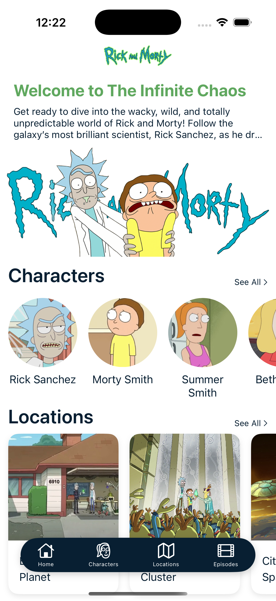

# Rick and Morty Challenge
Bienvenido a la documentación oficial del proyecto **Rick and Morty Challenge**.

**Rick and Morty Challenge** es una aplicación nativa desarrollada en **Swift** para dispositivos **iOS**, que permite explorar el universo de la famosa serie *Rick and Morty* de forma rápida, fluida y atractiva.

A través de una interfaz simple e intuitiva, la app permite a los usuarios:

- 🔍 **Buscar personajes** por nombre, especie, estado o género.
- 📄 **Visualizar detalles completos** de cada personaje, incluyendo su imagen, lugar de origen, ubicación actual y episodios en los que aparece.
- 📂 **Navegar por listas paginadas** obtenidas desde la [API oficial](https://rickandmortyapi.com/documentation).

## 💡 ¿Por qué nació esta app?

Este proyecto surgió de una motivación muy personal: 👉 seguir practicando y consolidando mis conocimientos en Swift. 

Hace unos años atras cuando decidí cambiarme del mundo Web al mundo Mobile, desarollé un pequeño challenge con [Rick and Morty API](https://rickandmortyapi.com/documentation) tomandole mucho cariño a esta API Rest. Hace unos meses, decidí rehacer aquel proyecto con el cual empece, pero esta vez aplicando todos los conocimientos y buenas practicas que con los años he adquirido teniendo asi un proyecto con un enfoque mas limpio y escalable.

Además, me he propuesto hacer de este proyecto una comunidad de codigo abierto, donde más personas puedan sumar al proyecto, espero poder cumplirlo.

**Puedes encontrar el código fuente en este enlace:** [https://github.com/majocampos92/RickAndMorty](https://github.com/majocampos92/RickAndMorty)

!!! tip
    Explora la documentación navegando por el menú de la izquierda.
---